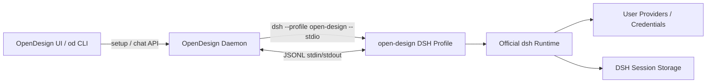

# DeepSeek Harness × OpenDesign 集成架构

本文说明 OpenDesign 中 DeepSeek Harness（DSH）Runtime 的定位、安装与检测、Profile 协议、Run 与 Session 生命周期、安全边界、测试覆盖和已知风险。

面向用户的一键安装与凭据配置说明见 [`deepseek-harness-one-click-install.zh-CN.md`](deepseek-harness-one-click-install.zh-CN.md)；所有 Agent Adapter 的通用约束见 [`agent-adapters.md`](agent-adapters.md)。

## 1. 结论

OpenDesign 中的 DSH 集成不是一个新的 DeepSeek API Client，也不是 OpenDesign 自己实现的 Agent Harness。实际边界是：

> 用户安装并拥有官方 `dsh` Runtime；OpenDesign 向其中安装一个名为 `open-design` 的 Profile Bundle，再通过版本化 JSONL stdin/stdout 协议驱动它。

核心设计：

- OpenDesign 不接管 DSH 的凭据、Provider、工具和 Session Storage。
- 一个 OS 进程只承载一个 OpenDesign Run，进程间通过 DSH Session Storage 冷恢复。
- Profile 协议支持结构化 thinking、text、tool call/result、usage、cancel 和 terminal result。
- Daemon 严格验证协议版本、Capability、Request ID、Session ID、终态和 Frame 大小。
- Connection Component 的安装必须由用户显式确认；生产包中的 tarball 使用 SHA-256 Manifest 校验。
- 主要风险不是协议状态机，而是对 DSH 预发布内部包的兼容性，以及 Profile/Daemon 两侧重复维护协议 Schema。

## 2. 官方 DSH 模型

官方 DeepSeek Harness 是一个通过插件和 Profile 组合的 Agent Runtime。模型、工具、Session、Sandbox、Storage、调度和 UI 都是组合树中的插件能力。

官方 CLI 的基本入口是：

```sh
dsh --profile <name>
```

Profile 位于：

```text
$DSH_HOME/profiles/<name>
```

未设置 `DSH_HOME` 时，默认根目录是 `~/.dsh`。Profile 的有效组合按顺序应用：

1. `package.json#dsh.profile.bundles` 中声明的 Bundle Patch；
2. Profile 自己的 `cordis.patch.yml`；
3. `$DSH_HOME/cordis.patch.yml`；
4. 命令行 `--patch` Overlay。

DSH Session 使用 event-sourced、append-only 的事件日志；模型消息历史从事件流派生。这是 OpenDesign 可以“每个 Run 启动新进程，但后续仍恢复同一个 Agent Session”的基础。

官方资料：

- [DeepSeek Harness 官方页面](https://www.deepseek.com/harness/en/)
- [官方 `dsh` CLI README](https://github.com/deepseek-ai/deepseek-harness/blob/master/apps/cli/README.md)
- [官方 CLI 行为规范](https://github.com/deepseek-ai/deepseek-harness/blob/master/apps/cli/reference/README.md)
- [官方 Session 设计](https://github.com/deepseek-ai/deepseek-harness/blob/master/packages/core/session/README.md)
- [Harness 数据处理声明](https://www.deepseek.com/harness/en/data-processing/)

## 3. OpenDesign 模块边界

| 模块 | 责任 |
|---|---|
| `apps/daemon/src/runtimes/defs/deepseek-harness.ts` | Runtime 注册、版本策略、Probe、模型目录和启动参数 |
| `packages/dsh-runtime/` | 安装到用户 DSH Profile 的 OpenDesign Bundle |
| `apps/daemon/src/agent-protocol/dsh-profile/` | Daemon 侧协议类型、验证器、JSONL Parser 和 Session Controller |
| `apps/daemon/src/agent-companion-setup.ts` | Bundle 构建、校验、安装和重新检测 |
| `apps/daemon/src/server.ts` | Run 启动、Prompt、Resume、SSE 和 Session 持久化 |
| `apps/web/src/components/DeepSeekHarnessSetupDialog.tsx` | 用户显式安装/修复入口 |
| `e2e/tests/dsh-installer-version-policy.test.ts` | 安装器、Daemon 版本策略和 Peer Range 一致性 |



## 4. `@open-design/dsh-runtime`

`packages/dsh-runtime` 是一个可发布的 DSH Profile Bundle：

```json
{
  "name": "@open-design/dsh-runtime",
  "version": "0.1.0"
}
```

它不包含：

- `dsh` 可执行文件；
- Node.js；
- Provider Credential；
- Provider 配置；
- DSH Session Storage；
- DSH 自带工具。

它只提供：

1. DSH Bundle Manifest；
2. Cordis Patch；
3. OpenDesign Startup Service；
4. JSONL Runtime Service；
5. 协议类型和 Frame 构造逻辑。

### 4.1 Bundle 声明

`packages/dsh-runtime/package.json` 使用：

```json
{
  "dsh": {
    "bundle": {
      "patch": "./cordis.patch.yml"
    }
  }
}
```

### 4.2 Cordis Patch

`packages/dsh-runtime/cordis.patch.yml`：

- 设置 OpenDesign Persona；
- 禁用 HMR；
- 插入 `open-design-startup` 和 `open-design-runtime` 两个 Service。

```yaml
- id: system-prompt
  config:
    persona: >-
      You are a coding and design agent running for OpenDesign...

- id: hmr
  disabled: true

- insert:
    - id: open-design-startup
      name: '@open-design/dsh-runtime/startup'

    - id: open-design-runtime
      name: '@open-design/dsh-runtime'
      inject: [openDesignStartup]
```

OpenDesign 每个 Run 使用一个短生命周期 DSH 进程，因此不需要 Profile 文件热加载。

### 4.3 官方 DSH Service 依赖

Runtime 注入：

```text
openDesignStartup
agentDefaultModel
agents
llm
sessions
sessionPersistence
```

它复用官方 DSH 的 Agent 创建/恢复、Model Selection、Provider Catalog、Session Event 和 Session Persistence，而不是自行实现这些能力。

## 5. 安装与检测

### 5.1 OpenDesign 不安装或替换 `dsh`

当用户选择 DeepSeek Harness 时：

1. Daemon 检测系统是否已有 `dsh`；
2. 没有可执行文件时返回 `AGENT_NOT_INSTALLED`；
3. 用户需先安装官方 DSH；
4. OpenDesign 只安装自己的 Connection Component。

仓库提供的一键 Bootstrap Installer 可以帮助用户安装兼容工具链，但 Adapter Setup 本身不会下载或替换 `dsh`。

### 5.2 Connection Component 安装

入口是 `installDeepSeekHarnessCompanion()`：

```text
读取或构建 @open-design/dsh-runtime tarball
→ 读取 manifest.json
→ 校验 packageName、version、文件名和 schemaVersion
→ 重新计算 SHA-256
→ 写入 DSH Profile 的 .open-design/<sha256>.tgz
→ dsh plugin --profile open-design add .open-design/<sha256>.tgz
→ 重新运行 Agent Detection
```

生产安装包携带预构建 tarball；开发模式执行：

```sh
pnpm --filter @open-design/dsh-runtime build
pnpm -C packages/dsh-runtime pack --pack-destination <temporary-directory>
```

相对 tarball 路径用于规避旧版 DSH Windows Shell Forwarder 对带空格绝对路径的拆分问题。

UI 和 CLI 使用同一个 Setup Endpoint：

```text
UI：DeepSeekHarnessSetupDialog
CLI：od agent setup deepseek-harness --json
```

取消不会修改 Profile，也不会改变 Agent Selection。

### 5.3 Detection Pipeline

Runtime Definition 首先运行：

```text
dsh --version
```

明确测试过的版本是：

```text
0.1.0-rc.8
0.1.1-rc.2
```

兼容模式接受：

- `0.1.x` Stable；
- `0.1.0-rc.6+`；
- 任意 `0.1.1-rc.N`。

Probe 前先检查：

```text
$DSH_HOME/profiles/open-design/package.json
```

这是为了避免早期 RC 在检测缺失 Profile 时发生隐式初始化。

Compatibility Probe：

```sh
dsh --profile open-design --probe
```

必须只输出一个 JSON Frame，并声明 Generation-1 必需能力：

```json
{
  "v": 1,
  "type": "probe",
  "runtime": "open-design",
  "protocol_version": 1,
  "plugin_version": "0.1.0",
  "capabilities": {
    "session_resume": true,
    "session_cancel": true,
    "structured_events": true
  }
}
```

### 5.4 模型目录

模型发现命令：

```sh
dsh --profile open-design --models
```

Profile 从用户当前配置的 DSH Provider 读取模型，并返回 Provider-qualified ID：

```text
provider/model
```

每个模型可以携带自己的 Reasoning Effort。模型目录只包含 Provider/Model 的 ID、名称和 Reasoning Option，不包含 Credential 或 Secret。

单个 Provider 的模型读取失败会被跳过并写入 DSH Logger，其余 Provider 仍可返回目录。

## 6. Run 启动与握手

Daemon 每个 Run 启动一个短生命周期进程：

```sh
dsh --profile open-design --stdio
```

Runtime Definition 的关键字段：

```ts
promptViaStdin: true
streamFormat: 'dsh-profile-jsonl'
resumesSessionViaProfileStdio: true
capturesSessionIdFromStream: true
supportsCustomModel: false
```

`packages/dsh-runtime/src/startup.ts` 要求 `--probe`、`--models`、`--stdio` 三个模式中必须且只能选择一个。

### 6.1 Ready Handshake

Profile 启动后先发送：

```json
{
  "v": 1,
  "type": "ready",
  "runtime": "open-design",
  "protocol_version": 1,
  "plugin_version": "0.1.0",
  "capabilities": {
    "session_resume": true,
    "session_cancel": true,
    "structured_events": true
  }
}
```

Daemon 验证后发送：

```json
{
  "v": 1,
  "type": "execute",
  "request_id": "<run-id>",
  "cwd": "<project-workspace>",
  "prompt": "<composed-prompt>",
  "model": {
    "provider": "provider-id",
    "id": "model-id"
  },
  "reasoning_effort": "high",
  "resume_session_id": "<optional>",
  "mcp_servers": []
}
```

每个 Profile 进程只接受一个 `execute`；第二个会返回 `DSH_PROFILE_BUSY`。

## 7. 协议 Frame

### 7.1 Host → Profile

| Frame | 作用 |
|---|---|
| `execute` | 启动或恢复一次 Turn |
| `cancel` | 取消指定 `request_id` |

### 7.2 Profile → Host

| Frame | 作用 |
|---|---|
| `probe` | Profile Compatibility |
| `ready` | Stdio Runtime 已就绪 |
| `models` | Provider-qualified Model Catalog |
| `session` | 声明持久 Session ID |
| `thinking` | Reasoning Delta |
| `text` | Assistant Text Delta |
| `tool_call` | Tool Invocation |
| `tool_result` | Tool Result |
| `usage` | Token Usage |
| `result` | `completed` / `cancelled` / `failed` |
| `protocol_error` | 命令或协议错误 |

Daemon 将运行 Frame 归一成 OpenDesign Agent Event：

```text
thinking     → thinking_start / thinking_delta / thinking_end
text         → text_delta
tool_call    → tool_use
tool_result  → tool_result
usage        → usage
session      → status + sessionId
```

## 8. JSONL 安全与状态机

Daemon Parser 位于 `apps/daemon/src/agent-protocol/dsh-profile/stream.ts`。

### 8.1 严格 JSONL

- stdout 是纯协议通道；
- 每行一个 JSON Object；
- Malformed JSON 立即进入 Fatal；
- 不接受多行 JSON；
- EOF 处完整但无换行的最后一个 Frame 可以接受；
- 错误不回显原始 Prompt、Tool Argument 或 Provider 内容。

### 8.2 Frame 大小

```ts
DEFAULT_DSH_PROFILE_MAX_FRAME_BYTES = 1024 * 1024
```

Parser 在完整行出现前也持续检查 Buffer，避免没有换行的超大输出无限累积。

### 8.3 协议不变量

Daemon 强制：

1. 第一帧必须是 `ready`；
2. Content Frame 前必须先收到 `session`；
3. Session Frame 只能出现一次；
4. Resume 返回的 Session ID 必须等于请求值；
5. `result.session_id` 必须与前面的 Session ID 相同；
6. 未由 OpenDesign 发起取消时，Profile 不能自行报告 `cancelled`；
7. stdout 结束前必须收到终态 `result`；
8. `failed` Result 必须包含结构化 Error；
9. 不同 `request_id` 的 Frame 不得污染当前 Run。

## 9. Session 创建与恢复

### 9.1 新 Session

Profile 生成：

```ts
SessionId(`od-${randomUUID()}`)
```

然后调用 DSH：

```ts
ctx.agents.create({
  sessionId,
  meta: { cwd },
  agentOptions: selection,
  setup,
  signal,
})
```

成功后发送：

```json
{
  "type": "session",
  "session_id": "od-...",
  "resumed": false
}
```

Daemon 从经过验证的 Session Frame 捕获并持久化 ID。

### 9.2 恢复 Session

后续 Turn 只有在 Agent、模型、项目 CWD、Conversation Cursor 和 Stable Prompt Context 都允许时才会恢复。恢复模式：

- 跳过完整 Transcript 重发；
- 在 `execute` 中加入 `resume_session_id`；
- Profile 调用 `ctx.agents.resume()`；
- DSH Session Persistence 从磁盘恢复事件日志。

因此上一个 `dsh` 进程已经退出并不影响冷恢复。

### 9.3 Resume 失败

Profile 区分：

```text
DSH_PROFILE_RESUME_REJECTED
DSH_PROFILE_RESUME_MISMATCH
DSH_PROFILE_SESSION_MISMATCH
```

Daemon 将 Resume Reject/Mismatch 送入共享 Resume Recovery Pipeline：记录诊断、抑制首次失败直接污染用户输出、放弃旧 Handle，并用完整 Transcript 重新 Seed，同时防止无限重试。

### 9.4 取消后的 Session

DSH Profile 承诺 Session Frame 建立后，即使当前 Turn 被取消，该 Session 仍可安全恢复。因此 Daemon 在取消时会保留已经捕获的 DSH Session ID。这个规则只适用于 `resumesSessionViaProfileStdio` Adapter，不自动推广到其他从输出流捕获 ID 的 CLI。

## 10. Cancellation、Error 与 Auth

### 10.1 Cancellation

Daemon 的 `abort()` 发送：

```json
{
  "v": 1,
  "type": "cancel",
  "request_id": "<run-id>"
}
```

Profile 同时执行：

```ts
controller.abort()
handle.agent.cancel({ kind: 'user' })
```

Cancellation Latch 覆盖三个竞态窗口：

1. `execute` 尚未创建 `AbortController`；
2. Session 正在 Create/Resume；
3. Turn 已完成但仍在 `flush()`。

取消早于 Execute 初始化时，Request ID 会先暂存，在 Controller 激活后立即 replay。

### 10.2 Error

Profile 将失败统一为：

```json
{
  "code": "...",
  "message": "..."
}
```

典型错误：

```text
DSH_PROFILE_SESSION_CREATE_FAILED
DSH_PROFILE_RESUME_REJECTED
DSH_PROFILE_EXECUTION_FAILED
DSH_PROFILE_TURN_BLOCKED
DSH_PROFILE_TURN_FAILED
DSH_PROFILE_MISSING_TURN_END
```

Daemon 的 `normalizeDeepSeekHarnessFailure()`：

- 不把 Object 强制转换成 `[object Object]`；
- 从嵌套 Error 中提取 Code/Message；
- 将 `MISSING_CREDENTIAL`、`DSH_PROVIDER_AUTH_FAILED` 等识别为 Auth Required；
- 使用安全、可操作的 Harness 配置指引替代原始 Auth Error。

Credential 始终由 DSH 管理，OpenDesign 不读取 Secret。

## 11. 数据所有权与安全边界

### 11.1 OpenDesign 拥有

- Bundle tarball；
- Bundle Manifest 和 SHA-256；
- Daemon 中保存的 DSH Session Handle；
- 子进程和 Run 生命周期；
- Prompt Composition；
- JSONL 协议验证；
- SSE 输出。

### 11.2 DSH 拥有

- `dsh` 可执行文件；
- `$DSH_HOME`；
- `open-design` Profile 的 Package/Plugin Composition；
- Provider 配置和 Credential；
- Agent Tool；
- Session Event Log；
- Session Persistence；
- Provider Model Catalog。

`DSH_HOME` 是外部工具目录，不属于 `OD_DATA_DIR`。OpenDesign 只有在用户显式执行 Setup 后，才向 `open-design` Profile 安装自己的 Bundle。

官方数据处理声明指出：配置外部模型、Web Tool、MCP 或插件后，这些服务可能上传用户数据。因此“本地 Harness”不等于“所有内容永不离开机器”；最终边界取决于用户配置的 Provider 和 Tool。

## 12. 与普通 DeepSeek Runtime 的区别

| 能力 | `deepseek` | `deepseek-harness` |
|---|---|---|
| 可执行文件 | `deepseek` / `codewhale` | `dsh` |
| 启动方式 | `exec --auto <prompt>` | `--profile open-design --stdio` |
| Prompt 传递 | argv | JSONL stdin |
| Stream | Plain Text | Structured JSONL |
| Tool Call | stderr，不结构化 | `tool_call` / `tool_result` |
| Thinking | 无可靠结构 | `thinking` |
| Usage | 无统一结构 | `usage` |
| Session Resume | 无 | DSH Session Persistence |
| Cancel | 通用进程取消 | 协议 Cancel + Agent Cancel |
| Model Catalog | 静态 fallback + custom | 用户 DSH Provider Catalog |
| 自定义模型 | 支持 | 不支持任意 ID |
| Prompt 大小 | 30 KB argv 限制 | stdin，无 argv Prompt 限制 |

DSH 不是普通 DeepSeek Runtime 的新版 Parser，而是一套不同的执行栈。

## 13. 设计优点

### 13.1 用户拥有 Runtime

OpenDesign 不重复实现 Credential Store、Provider Adapter、Tool Framework 或 Session Database，只维护一条协议边界。

### 13.2 每 Run 一个进程

进程隔离让故障、取消和 stdin 生命周期更清楚；跨进程连续性由 DSH Session Storage 提供。

### 13.3 协议事实明确

协议包含 Version、Capability、Request ID、Session ID、明确终态和 Frame Size Limit，避免从自然语言 stdout 猜测运行状态。

### 13.4 安装策略可审计

- 生产携带精确 tarball；
- Manifest + SHA-256；
- 包名、文件名和 Schema 校验；
- Setup 后重新 Probe；
- 安装器版本、Daemon Policy、Peer Range 有跨边界测试；
- `.github/scripts/dsh-upstream-drift.ts` 监控上游版本漂移。

## 14. 风险与建议

### P1：紧耦合 DSH 预发布内部 API

`@open-design/dsh-runtime` 直接依赖或 Peer-require：

```text
@deepseek-ai/cordis
@deepseek-ai/dsh-agent
@deepseek-ai/dsh-agent-default-model
@deepseek-ai/dsh-llm
@deepseek-ai/dsh-session
@deepseek-ai/dsh-invariants
@deepseek-ai/dsh-cmdline
```

DSH 仍在 RC 演进。`SessionEvent`、`AgentHandle`、Cordis 注入名或 Tool Result 结构变化都可能破坏集成。

已有缓解是 Version Policy、Peer Range、Installer/Daemon 一致性测试和 Upstream Drift Monitor。后续应继续把所有 DSH 结构假设封装在 `packages/dsh-runtime`，禁止 Daemon 直接依赖 DSH Package。

### P1：协议 Schema 双份维护

协议分别定义在：

```text
packages/dsh-runtime/src/protocol.ts
apps/daemon/src/agent-protocol/dsh-profile/types.ts
```

跨进程隔离使这种重复有合理性，但存在字段漂移风险。建议增加跨包 Contract Fixture Test：Profile 生成的每类 Frame 必须被 Daemon 当前 Parser 接受。无需为了消除重复引入新的运行时共享依赖。

### P1：Session 没有绑定 DSH/Profile 版本

Daemon 持久化 Session ID，但 Resume Metadata 没有明显绑定产生该 Session 的 DSH Version、Profile Plugin Version 和 Protocol Version。

如果未来 DSH Session Storage 发生不兼容升级，旧 Handle 可能集中进入 Resume Reject，再依赖 Auto-reseed 恢复。建议持久化这些版本事实，并在明确不兼容时跳过 Resume。

### P2：MCP 字段目前是占位

协议含有 `mcp_servers`，但 Daemon 当前固定发送空数组，Profile 执行逻辑也不消费它。这不影响 DSH Profile 自己配置的 MCP，但 OpenDesign `.od/mcp-config.json` 不会被转发给 DSH。

应二选一：实现 OpenDesign MCP → DSH Profile 注入；或将字段明确标记为 Reserved，避免形成“已经支持”的错误印象。

### P2：`max-tokens` 被视为成功

`resultStatus()` 将 `completed` 和 `max-tokens` 都映射为 `completed`。对于要求完整文件交付的任务，达到 Token 上限可能意味着结果被截断。

建议保持 `stop_reason: max-tokens`，但把是否显示“不完整”交给上层产品策略，并为该行为添加直接测试。

### P2：Profile 重复缓冲完整 Assistant Output

Profile 已逐段发送 `text` Frame，同时还累积完整 `assistantOutput`，最后放进 `result.output`。Daemon 当前主要消费实时 Delta，并不依赖终态 Output。

长输出会形成额外内存和字符串拼接成本。确认无兼容消费者后，可取消 `result.output` 或只保留有界 Tail。

### P2：安装失败没有事务回滚

如果 `dsh plugin add` 成功而后续 Probe 失败，Setup 返回 `COMPANION_STILL_INCOMPATIBLE`，但不会回滚刚安装的 Bundle。

应明确这是可修复状态，并确保下一次 Setup 能覆盖修复。如果上游 Plugin Manager 提供可靠移除操作，可以再考虑回滚；不要直接手工改写 Profile `package.json`。

### P3：一个进程一个 Run 的启动成本

这种设计用启动延迟换取隔离和简单生命周期。目前没有测量证明它是瓶颈。已有 `onReady`、`onSession` 钩子，可以记录：

```text
process spawn → ready
ready → session
session → first token
```

没有数据前不应改成长驻 DSH 进程。

## 15. 测试覆盖与验证

主要测试：

- `packages/dsh-runtime/tests/protocol.test.ts`
- `apps/daemon/tests/agent-protocol/dsh-profile.test.ts`
- `apps/daemon/tests/agent-companion-setup.test.ts`
- `apps/daemon/tests/runtimes/deepseek-harness-windows.test.ts`
- `apps/daemon/tests/runtimes/version-policy.test.ts`
- `apps/daemon/tests/native-session-recovery.test.ts`
- `apps/daemon/tests/agent-session-resume.test.ts`
- `e2e/tests/dsh-installer-version-policy.test.ts`
- `e2e/tests/scripts/dsh-upstream-drift.test.ts`

调研时执行：

```sh
pnpm --filter @open-design/dsh-runtime test
```

结果：1 个 Test File、12 个 Test 全部通过。

```sh
pnpm --filter @open-design/daemon test \
  tests/agent-protocol/dsh-profile.test.ts \
  tests/agent-companion-setup.test.ts \
  tests/runtimes/deepseek-harness-windows.test.ts \
  tests/runtimes/version-policy.test.ts \
  tests/native-session-recovery.test.ts \
  tests/agent-session-resume.test.ts
```

结果：6 个 Test File 全部通过，112 个通过、1 个跳过。

```sh
pnpm --filter @open-design/e2e test \
  tests/dsh-installer-version-policy.test.ts \
  tests/scripts/dsh-upstream-drift.test.ts
```

结果：2 个 Test File、16 个 Test 全部通过。

运行环境使用 Node `24.15.0`；`shells/terminal` 声明期望 `24.18.0`，因此命令输出包含 Engine Warning，但上述 DSH 定向测试均通过。
